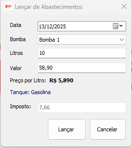
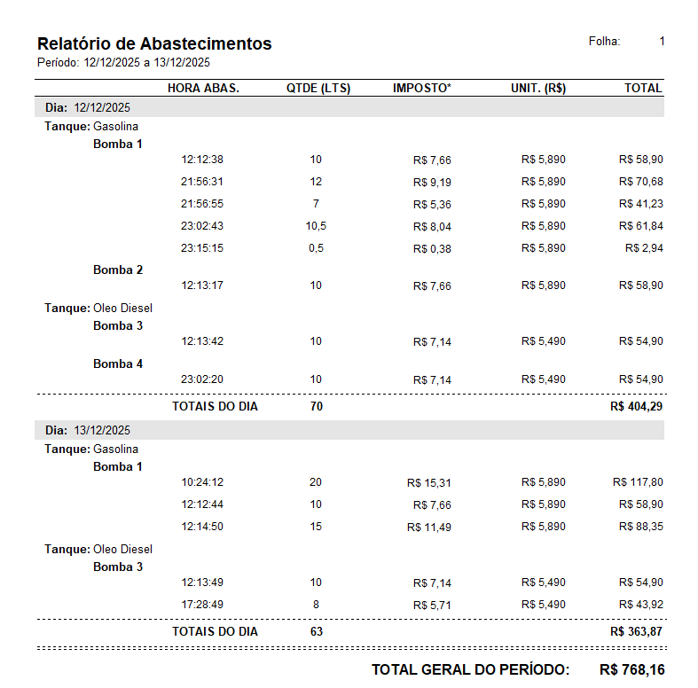

# Sistema de Gerenciamento - Posto ABC

Sistema desenvolvido em Delphi para gerenciar abastecimentos e tanques de combustíveis do Posto ABC.

## Funcionalidades

### 1. Cadastro de Abastecimentos

- Registro de abastecimentos com:
  - Seleção de bomba
  - Data do abastecimento
  - Quantidade de litros (o valor é calculado automaticamente)
  - Cálculo automático de imposto (13% sobre o valor)
  

### 2. Relatório de Abastecimentos

- Relatório agrupado por:
  - Dia
  - Tanque
  - Bomba
- Exibe o valor de cada abastecimento
- Total geral do período selecionado
- Filtro por período (data início e data fim)

## Organização do Código

### Arquitetura MVC

O projeto está organizado seguindo o padrão MVC:

- **Models** (`src/models/`): Classes de modelo de dados puros, sem lógica de negócio
- **Views** (`src/views/`): Formulários e interface do usuário
- **Controllers** (`src/controllers/`): Coordenam a lógica de negócio entre models, repositories e views.

### Pastas

- `sql/` - Scripts SQL do banco de dados
- `src/models/` - Modelos de dados (MVC)
- `src/views/` - Formulários/Interface (MVC)
- `src/controllers/` - Controllers (MVC)
- `src/repositories/` - Repositórios para acesso a dados
- `src/interfaces/` - Interfaces
- `lib/` - Arquivos compilados (DCUs)

## Observações

- O sistema utiliza componentes nativos do Delphi
- O relatório utiliza Fortes Report (RLReport)
- A conexão com o banco é feita via FireDAC
- O imposto é calculado automaticamente como 13% do valor do abastecimento
- O valor do abastecimento é calculado automaticamente: Litros × Preço por Litro
- O caminho do banco de dados está configurado para pasta database dentro da pasta do executável

